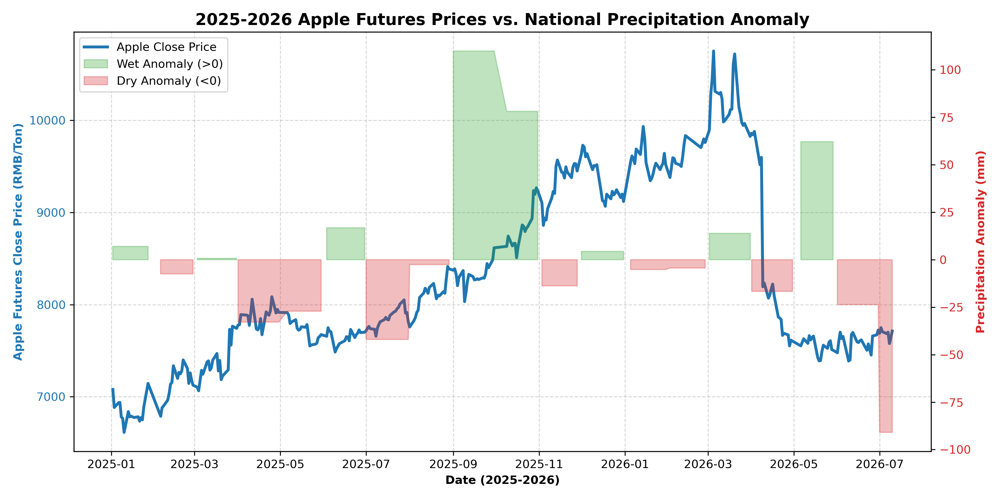

# Dystal Corvus-AP.CZC

Dystal Corvus-AP.CZC is a meteorological-driven machine learning quant model for Chinese Apple Futures (CZCE: AP), developed under **Dystal Capital**.

By removing noisy price-based technical indicators and cross-commodity price signals, the model focuses purely on global climate oscillations and regional meteorological anomalies to forecast price dynamics.

## Research Thesis & Motivation
With the northward shift of China's rain belts, the agricultural climate in major apple producing regions has experienced significant volatility. Between 2025 and 2026, Chinese apple futures (CZCE: AP) prices showed a distinct and strong trend corresponding to local precipitation anomalies:
- **Spring/Summer Drought (April & July 2025)**: Rainfall was significantly below normal (anomalies of **-32.9 mm** and **-42.0 mm**), raising crop yield concerns and driving average prices up from ~7,300 to ~8,100 RMB/ton.
- **Harvest Rain Damage (September & October 2025)**: Extremely heavy autumn rainfall during harvest (anomalies of **+109.9 mm** and **+78.1 mm**) degraded fruit quality, causing deliverable apple prices to surge to a peak of **~9,500 RMB/ton** in early 2026.
- **Spring 2026 Rainfall**: Plentiful rain in May 2026 (anomaly of **+62.1 mm**) relieved drought worries, correcting prices back to ~7,500 RMB/ton.

This climatic mismatch creates robust weather-driven arbitrage and directional trading opportunities, which the **Corvus-AP.CZC** model is designed to exploit.

### 📈 2025-2026 Price vs. Precipitation Trend

*Empirical Validation*: Backtest verification over this out-of-sample period (2025-01-01 to 2026-07-10) demonstrates the predictive power of these climatic signals, yielding a **0.7576 Sharpe ratio** and a **14.71% cumulative return** (net of transaction fees and slippage).

## Key Features
- **Global ENSO Driver**: Incorporates monthly NOAA ERSSTv5 Niño 3.4 Sea Surface Temperature (SST) anomalies.
- **Regional Precipitation Anomalies**: Calculates daily rainfall deviation relative to the historical monthly mean across 4 major Chinese apple production regions (Luochuan, Yantai, Tianshui, and Lingbao).
- **Short-Term Forecast Proxy**: Includes 7-day forward average temperature and precipitation sum.
- **Scale-Invariant Proportional Adjustment**: Prices are adjusted using ratio-based back-adjustment to ensure daily returns and volatility features are completely leak-free and independent of dataset boundaries.
- **SQLite Cache Pipeline**: Full local database caching for both futures price and meteorological data, allowing execution in under 1 second.

## Walk-Forward Backtest Results
Running the rolling walk-forward test over the 2017-2026 dataset yields the following metrics (net of transaction fees and slippage):
- **Overall Sharpe Ratio**: -0.1844
- **Pre-2025 Period (Historical Dev)**: Sharpe of -0.6042
- **Post-2025 Period (Pure Out-of-Sample)**: Sharpe of **0.7576**, Cumulative Return of **14.71%**

Once trained on a sufficiently large historical baseline, the model shows robust out-of-sample forward predictive power in recent years.

## Files
- `ap_future_quant.py`: Main CLI strategy script.
- `equity_curve_meteorological.png`: Cumulative return plot for the meteorological model.
